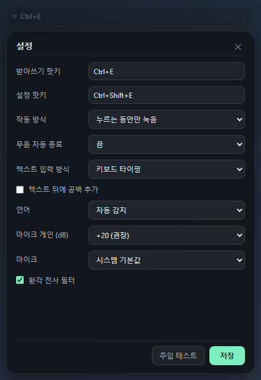

# Codex Mic / 코덱스 마이크

**Hold `Ctrl+E`, speak, release — your words are typed wherever the keyboard focus is.**

**`Ctrl+E`를 누른 채로 말하고 손을 떼면, 키보드 포커스가 있는 곳에 그대로 타이핑됩니다.**

A native Windows voice dictation tool — Tauri + Rust, no Electron, no Python.
It authenticates with your existing **Codex CLI login**, so there is no API key
to manage. Audio never touches a webview: cpal captures it, Rust encodes Opus,
and it streams over WebRTC.

네이티브 윈도우 음성 받아쓰기 도구입니다(Tauri + Rust). **Codex CLI 로그인만으로**
동작하며 API 키가 필요 없습니다. 오디오는 webview를 거치지 않고 Rust에서 직접
캡처·인코딩되어 WebRTC로 전송됩니다.

<p align="center">
  
  
</p>

> **Unofficial project / 비공식 프로젝트.** Not affiliated with OpenAI.
> Provided as-is for personal use and study — adjust it to your needs and use it
> at your own risk.
> OpenAI와 무관한 비공식 프로젝트입니다. 각자 책임 하에 자유롭게 고쳐 쓰세요.

---

## Install / 설치

Grab the latest `codex-mic-*-windows-x64.exe` from
**[Releases](../../releases/latest)** and run it. It is a single self-contained
executable — no installer, no runtime to download on Windows 11.

**[Releases](../../releases/latest)** 에서 exe를 받아 실행하면 됩니다. 설치 과정이
없는 단독 실행 파일입니다.

Before the first run, sign in to the Codex CLI once:

```powershell
codex login
```

The binary is **not code-signed**, so SmartScreen will warn on first launch:
`자세히` / `More info` → `실행` / `Run anyway`. If you would rather not trust an
unsigned build, [build it yourself](#build--test--빌드--테스트) — it takes one
command.

서명되지 않은 바이너리라 SmartScreen 경고가 뜹니다. 찜찜하면 직접 빌드하세요.

---

## Quick start / 사용법

```
1. Click where you want the text — terminal, editor, chat, anywhere
2. Hold Ctrl+E and speak; the pill reacts the moment the key goes down
3. Release; the transcript is typed at the cursor

1. 타이핑할 곳을 클릭 (터미널, 에디터, 채팅 어디든)
2. Ctrl+E를 누른 채로 말하기 — 키를 누르는 즉시 pill이 반응
3. 손 떼기 → 커서 위치에 타이핑
```

| pill | meaning / 의미 |
|------|----------------|
| `Ctrl+E` (dim) | idle — dims out of the way, brightens on hover / 대기 |
| `듣는 중…` + red dot + level meter | recording / 녹음 중 |
| `변환 중…` | draining audio, waiting for the final transcript / 마무리 중 |
| `✓ text…` | typed at the cursor / 타이핑 완료 |
| `⚠ …` | something went wrong — the message says what / 오류 |

The pill never takes keyboard focus, so clicking or dragging it does not steal
focus from the app you are dictating into. Drag it anywhere; the position is
remembered.

pill은 키보드 포커스를 절대 가져가지 않으므로, 드래그하거나 클릭해도 받아쓰기
대상 창의 포커스를 뺏지 않습니다. 위치는 저장됩니다.

---

## Features / 기능

| Feature | Description |
|---------|-------------|
| Push-to-talk | Hold, speak, release. Toggle mode is one setting away. |
| Types anywhere | Lands wherever the keyboard focus is — terminals, editors, browsers |
| Nothing gets cut off | The commit waits for the server's final transcript instead of typing whatever had arrived when you let go |
| Modifier-safe | Text is never injected while Ctrl/Shift/Alt/Win is still held, so chord hotkeys never fire shortcuts in the target app |
| Live level meter | The pill shows your mic level while recording, so a dead mic is visible immediately |
| Quiet-mic boost | Built-in gain with a soft limiter for faint laptop/USB microphones |
| Korean + English | Auto-detects; 한영혼용 works, and it never transliterates one into the other |
| Never auto-Enter | Newlines and tabs are stripped, so it cannot submit your chat by accident |
| CapsLock-friendly | If you bind CapsLock, the lock state is put back the way it was |

---

## Settings / 설정

Press **`Ctrl+Shift+E`**. Saved to `%APPDATA%\codex-mic\config.json`; hotkey
changes apply instantly, without a restart.

**`Ctrl+Shift+E`** 로 엽니다. `%APPDATA%\codex-mic\config.json`에 저장되고 핫키는
재시작 없이 즉시 적용됩니다.

| Setting / 설정 | Options | Default |
|----------------|---------|---------|
| Dictation hotkey / 받아쓰기 핫키 | any key or chord | `Ctrl+E` |
| Settings hotkey / 설정 핫키 | any shortcut | `Ctrl+Shift+E` |
| Activation / 작동 방식 | push-to-talk, toggle | push-to-talk |
| Silence auto-stop / 무음 자동 종료 | off, 1.5s, 2.5s, 4s | off |
| Injection / 텍스트 입력 방식 | keystrokes, clipboard paste | keystrokes |
| Restore clipboard / 클립보드 복원 | on/off (clipboard mode) | on |
| Trailing space / 뒤에 공백 | on/off | off |
| Language / 언어 | auto, 한국어, English | auto |
| Mic gain / 마이크 게인 | 0, +10, +20, +30 dB | +20 dB |
| Microphone / 마이크 | system default or any input | default |
| Hallucination filter / 환각 필터 | on/off | on |

### Picking a hotkey / 핫키 고르기

A global hotkey is registered system-wide, so **while Codex Mic is running, no
other app receives it.** `Ctrl+E` is the default because it is deliberate enough
never to fire by accident — but it does take `Ctrl+E` away from your shell's
"move to end of line" and VS Code's quick-open. `F9`, `` ` ``, `F13` and
`CapsLock` are conflict-free alternatives.

전역 핫키라 **앱이 떠 있는 동안 다른 앱은 그 키를 받지 못합니다.** 셸의 줄 끝
이동이나 VS Code 빠른 열기가 걸린다면 `F9`, `` ` ``, `CapsLock` 등으로 바꾸세요.

A **bare modifier cannot be a hotkey** — `Alt`, right Alt and right Shift are
not registrable on their own, so the popular "hold right Alt to talk" is not
available. Verified working single keys: `F9`, `F13`, `CapsLock`, `` ` ``,
`Space`, `ScrollLock`, `Pause`, `NumLock`, `Insert`, `Home`.

**수정자 키 단독은 핫키가 될 수 없습니다** — 오른쪽 Alt/Shift 같은 키는 등록되지
않습니다. 단독으로 쓸 수 있는 키: `F9`, `F13`, `CapsLock`, `` ` ``, `Space`,
`ScrollLock`, `Pause`, `NumLock`, `Insert`, `Home`.

To check any other key string:

```powershell
cd src-tauri; cargo run --example hotkeys
```

---

## Troubleshooting / 문제 해결

**Nothing gets typed, and the pill says the mic has no signal.**
Watch the level meter while you speak. If the bar barely moves, raise **Mic
gain** — many laptop and USB microphones deliver speech far below the level the
server's voice detection triggers on. If it does not move at all, the wrong
input device is selected.
레벨 미터가 안 움직이면 마이크 게인을 올리거나 마이크 장치를 바꾸세요.

**The hotkey does nothing.**
Another app registered it first — the pill shows a registration error at
startup. Pick a different key in settings. Note that an app started *after*
Codex Mic cannot steal an already-registered hotkey, and vice versa.
다른 앱이 먼저 잡았을 수 있습니다. 다른 키로 바꾸세요.

**Text lands in the wrong window.**
Text goes to whatever had keyboard focus. Click into the target first; the pill
itself never takes focus. Use the **주입 테스트** button in settings to verify
injection before dictating for real.

**`codex login` 필요 warning on startup.**
The app reads the Codex CLI's stored OAuth tokens. Run `codex login` once and
restart.

**Long text is slow to appear.**
Switch **Injection** to clipboard paste: it stages the text and sends one
`Ctrl+V` instead of replaying every keystroke, then restores your previous
clipboard about a second later.

---

## Build & test / 빌드 & 테스트

Requirements: Windows 10/11, Rust 1.77+, CMake on `PATH` (libopus is built from
source). Windows 11 ships WebView2; on Windows 10 you may need the
[WebView2 runtime](https://developer.microsoft.com/microsoft-edge/webview2/).

```powershell
cd src-tauri
cargo build --release          # → target/release/codex-mic.exe
cargo test                     # 66 unit tests, no hardware or network needed
```

Opt-in tests that touch real hardware or the live service:

```powershell
$env:CODEX_MIC_AUDIO = "1"; cargo test          # real microphone capture
$env:CODEX_MIC_INTEGRATION = "1"                # live OAuth WebRTC end-to-end
$env:CODEX_MIC_TEST_PCM = "speech-48k-mono.pcm" #   (needs a speech sample)
cargo test -- --nocapture
```

Signal-debugging helpers:

```powershell
cargo run --example devices    # list input devices + the system default
cargo run --example micprobe   # 6s capture on every device, prints RMS/peak
cargo run --example hotkeys    # which key strings parse into shortcuts
```

Environment switches:

| Variable | Effect |
|----------|--------|
| `CODEX_MIC_DEBUG_PCM_FILE` | Feed the pump a 48 kHz mono PCM16LE file on loop instead of the microphone — separates "capture" bugs from "session" bugs |
| `CODEX_MIC_SESSION_STALE_SECS` | How long a realtime call is reused before being recreated (default 90) |
| `RUST_LOG=codex_mic=debug` | Verbose tracing |

---

## How it works / 구조

```
hold hotkey → cpal capture (→ 48 kHz mono) → gain + soft limiter
            → Opus encode (static libopus) → WebRTC realtime session
release     → drain the last PCM → flush the partial frame → silence tail
            → wait for the final transcript → sanitize → type (or Ctrl+V)
```

The interesting part is the **release path**. Transcription lags speech, so
committing the instant the key comes up truncates the end of every sentence and
returns nothing at all for short ones. Instead the commit hands over the audio
the pump had not read yet, zero-pads the partial Opus frame, sends a beat of
digital silence so the server's voice detection can close the turn, and only
then waits — for the authoritative `turn.done`, or for the transcript to go
quiet, or for a deadline.

핵심은 **키를 뗀 뒤의 경로**입니다. 전사는 음성보다 늦게 도착하므로, 즉시 커밋하면
문장 끝이 잘리고 짧은 발화는 통째로 비어버립니다. 남은 오디오를 마저 보내고
서버의 최종 전사를 기다린 뒤에 타이핑합니다.

Everything that can start or stop a recording — key down, key up, silence
auto-stop, the realtime failure watchdog, and the "you let go while we were
still connecting" catch-up — goes through one state machine, so no two paths can
both decide to start (or both decide to stop) the same recording.

```
src-tauri/src/
  lib.rs       — hotkey handling, PCM pump, recording lifecycle
  keystate.rs  — the Idle/Starting/Recording/Stopping state machine
  winkeys.rs   — Win32 keyboard state: caps toggle, modifier-held checks
  realtime.rs  — WebRTC realtime session, Opus encode, transcript events
  audio.rs     — cpal capture, downmix, resample, gain
  dictate.rs   — transcript accumulation, commit timing, sanitize, injection
  auth.rs      — Codex CLI OAuth tokens, refresh
  config.rs    — persistent settings
  commands.rs  — Tauri commands + shared app state
ui/            — pill + settings panel (plain HTML/CSS/JS, no framework)
examples/      — devices.rs, micprobe.rs, hotkeys.rs
```

Tweak freely — hotkeys, prompts, gain, language behavior, injection style. It is
all small single-purpose modules with tests next to them.
자유롭게 고쳐 쓰세요.

## License

MIT
